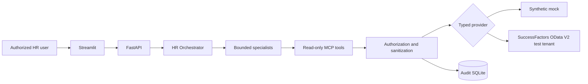
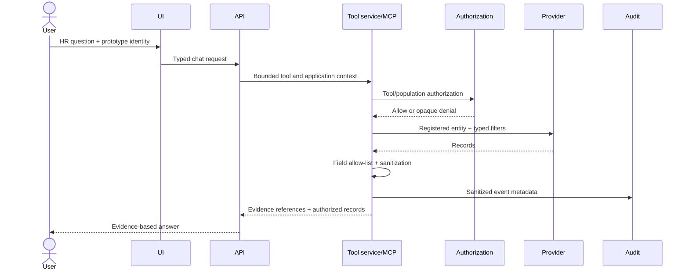

# Architecture

## Components

The provider interface is the replacement seam: agents and MCP schemas remain unchanged when moving from mock data to a real tenant.

## Request sequence

## Trust boundaries

User messages, model output, provider text, and upstream OData responses are untrusted. Identity and scope originate server-side. Only the tool service may reach a provider. It validates enums, values, limits, dates, permissions, and returned fields. Tool results are data and cannot change agent instructions.

## Agents

The HR Orchestrator owns the final answer. Employee Central, Position Management, Data Quality, and Security Review specialists are bounded `Agent.as_tool()` tools. In credential-free mock mode, deterministic routing provides the same controlled service boundary.

## Mock versus real

Mock and demo modes use coherent synthetic records. Real mode constructs the OData provider only after typed settings validate. It never silently falls back. The query builder selects only registered fields, escapes literals, caps `$top`, and rejects URLs/query fragments.

## Audit and deployment

Audit events store operational metadata, hashed business keys, outcome, duration, and source—never full payloads or credentials. Native Windows uses three localhost processes. Docker Compose mirrors this topology and persists the audit database.

## Production migration

Replace demonstration identity with enterprise SSO, map claims to server-owned RBP scopes, implement and validate the tenant OAuth flow, use managed secrets and an enterprise audit store, add network controls, validate metadata/effective dating against a test tenant, conduct privacy/security review, and establish retention/incident procedures.
